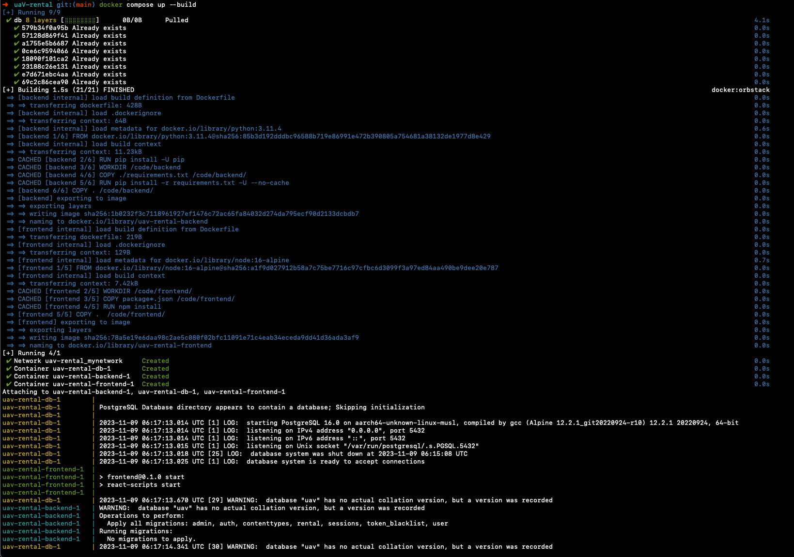

# UAV-rental

UAV Rental Project

This project is created based on UAV Rental Project. Uses Django and Django RestFramework as backend, uses React for frontend and uses Postgresql for Database

Detailed Tech Stacks:

- Backend:

  - [Django](https://www.djangoproject.com/)
  - [Django RestFramework](https://www.django-rest-framework.org/)

- Frontend:

  - [React](https://react.dev/)
    - [Antd](https://ant.design/)
    - [Tailwindcss](https://tailwindcss.com/)

- Database:
  - [PostgreSQL](https://www.postgresql.org/)

## Setting Up

All stacks in projects controlled with Docker (see: <a href='docker-compose.yml'/>docker-compose</a>)

If you don't have [`Docker`](https://www.docker.com/) in your computer

```sh
~$ brew install docker
```

After installation is done. you can run project with

```sh
~$ docker-compose up --build
```

This command runs all of the three container and they be able to connect each other

(image: after docker build is done)



For accessing the frontend you need to go to [`http://localhost:3000/`](https://www.docker.com/) port from your browser to access frontend

if you want to access admin panel you can directly go to [`http://127.0.0.1:8000/admin/`](http://127.0.0.1:8000/admin/)

**NOTE**: _username: admin, password: admin_

address to access all of the db management interface provided from django
